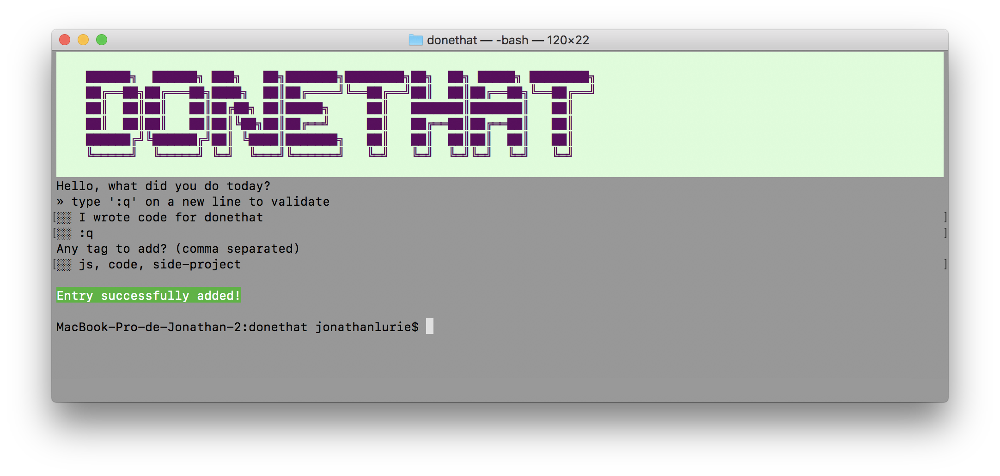
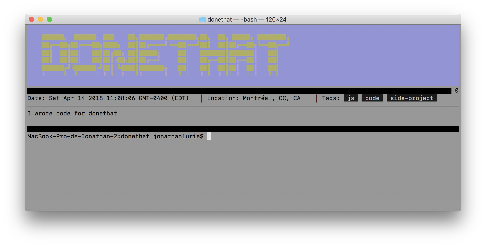
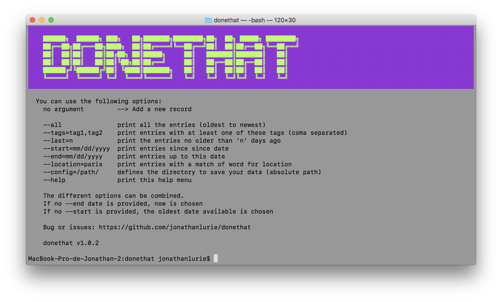

**donethat** is activity logger in the terminal.  
As developers, the tool we use the most is the terminal and as developers, we sometimes have to report what we have done on the past week or month.  
**donethat** uses a local folder to store all its data (not a database), and every new entry is a of the form of a small JSON file in the workin directory of your choice. In addition, every new entry can come with tags (coma separated) so that you can annotate them for easy searching. (I personally use a Dropbox folder to store my *donethat* data).

Every new record with save the main message, the date, time and timezone and the geographical location (as "city, region, country")

Writing a new entry:  


Display a subset of the entries. Here, `-last=1` shows only entries from 1 day ago:


The help menu:


As shown on the help menu, we can display all the entries even written or a subset of them, using different options that we can combine:
```
--all               print all the entries (oldest to newest)
--tags=tag1,tag2    print entries with at least one of these tags (coma separated)
--last=n            print the entries no older than 'n' days ago
--start=mm/dd/yyyy  print entries since since date
--end=mm/dd/yyyy    print entries up to this date
--location=paris    print entries with a match of word for location
```

## Install
```
npm install -g donethat
```

## Run
To add a new record, from the terminal:
```
donethat
```
Then a prompt will show-up. If it's the first time you launch *donethat*, the prompt will ask you for a place to store data. So, the fist time you launch donthat, you should do:
```
donethat --config=/some/absolute/path
```

To display the records of the the last 7 days:
```
donethat --last=7
```


# TODO
- Display statistics (tags, locations, frequency)
